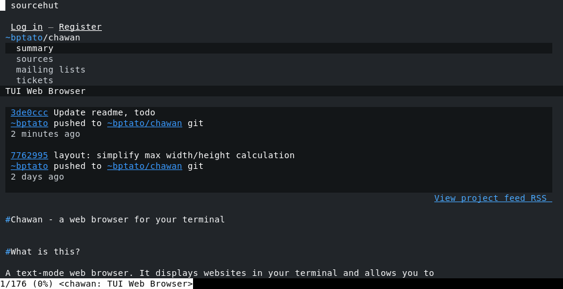

# Chawan - a web browser for your terminal

[Project page](https://sr.ht/~bptato/chawan)



## What is this?

A text-mode web browser. It displays websites in your terminal and allows
you to navigate on them.

It can also be used as a terminal pager.

## Compiling

Note: a POSIX-compliant operating system is required. (Windows is not
supported yet.)

1. Clone the Chawan repository:
   `git clone https://git.sr.ht/~bptato/chawan && cd chawan`
2. Install the Nim compiler: <https://nim-lang.org/install.html>
	* Please use 1.6.14 or newer, ideally 2.0.0. Older versions will
	  not work. (You can check your Nim compiler's version using `nim -v`.)
3. Install the following dependencies:
	* libcurl: <https://curl.se/libcurl/>
	* zlib: <https://zlib.net/>
	* pkg-config, pkgconf, or similar (must be found as "pkg-config"
	  in PATH)
	* If you are using a system where the default make program is not
	  GNU make (e.g. BSD), install gmake and use it in the following steps.
4. Download parts of Chawan found in other repositories: `make submodule`
5. Run `make`. (By default, this will build in release mode; for development,
   use `make TARGET=debug`. For details, see [doc/build.md](doc/build.md).)
6. If you want manpages, run `make manpage`.
7. Finally, install using `make install` (e.g. `sudo make install`)

Then, try:

```bash
$ cha -V # open in visual mode for a list of default keybindings
$ cha example.org # open your favorite website directly from the shell
```

## Features

Currently implemented features are:

* multi-processing (several buffers can be loaded at once)
* multi-charset, double-width aware text display (but no bi-di yet)
* HTML5 support
* a CSS-capable layout engine
	* flow layout is supported (now with floats!)
	* table layout is supported, except for fixed tables
	* the box model is mostly implemented, except for borders
* forms
* incremental loading of plain text streams (but not HTML documents yet)
* JavaScript based navigation
* JavaScript support in documents
	* some basic DOM manipulation APIs are supported
	* off by default; use is discouraged until sandboxing is
	  implemented
* cookies
* Supports several protocols: HTTP(S), FTP, Gopher, Gemini, Finger
* Can load user-defined protocols/file formats using [local CGI](doc/localcgi.md),
  [urimethodmap](doc/urimethodmap.md) and [mailcap](doc/mailcap.md)

...with a lot more [planned](todo).

## Documentation

* manpage: [doc/cha.1](doc/cha.1)
* configuration options: [doc/config.md](doc/config.md)
* mailcap: [doc/mailcap.md](doc/mailcap.md)
* mime.types: [doc/mime.types.md](doc/mime.types.md)
* urimethodmap: [doc/urimethodmap.md](doc/urimethodmap.md)
* local CGI: [doc/localcgi.md](doc/localcgi.md)
* protocols: [doc/protocols.md](doc/protocols.md)

## Neighbors

Many other text-based web browsers exist. Here's some recommendations if you
want to try more established ones:

* [w3m](https://github.com/tats/w3m) - A text-mode browser, extensible using
  local-cgi. Also has inline image display and very good table support.
  Inspired many features of Chawan.
* [elinks](https://github.com/rkd77/elinks) - Has CSS and JavaScript support,
  and incremental rendering (it's pretty fast.)
* [lynx](https://lynx.invisible-island.net/) - "THE text-based web browser."
* [edbrowse](http://edbrowse.org/) - This one looks more like `ed` than
  `less` or `vi`. Mainly designed for blind users.
* [browsh](https://www.brow.sh/) - Firefox in your terminal.

## FAQ

### Why does Chawan use strange/incorrect/ugly colors?

Chawan assumes the terminal's default background/foreground colors are
black and white. If this is not true for your terminal, make sure to set
the display.default-background-color and display.default-foreground-color
properties in your Chawan configuration file.

Also, by default, Chawan uses the eight ANSI colors to display colored
text. To use true colors, either export COLORTERM=truecolor or set the
display.color-mode to "24bit". To use 256 colors, set display.color-mode to
"8bit" instead. (You can also turn off colors and/or styling altogether in
the configuration; please consult [doc/config.md](doc/config.md) for details.)

### Can I view Markdown files using Chawan?

[Yes.](doc/mailcap.md)

### Why write another web browser?

I've found other text-based web browsers insufficient for my needs, so
I thought it'd be a fun excercise to write one by myself, for myself.

Generally, I'm happy if Chawan works on websites I use frequently. If it
also works on other websites, that's a bonus.

### Where are the w3m keybindings?

At [bonus/w3m.toml](bonus/w3m.toml). Note that not every w3m feature is
implemented yet, so it's not 100% compatible.

I use vi for editing text, and I prefer my pager to function similarly to
my editor. Hence the default vi-like keybindings.

### Why does *website X* look awful in Chawan?

As mentioned above, the layout engine is still very much a work in progress. At
this point, it's more interesting if a website works as intended in Chawan
than if it doesn't.

### Where are the tabs?

Chawan does not have browser tabs. Instead, each website is opened in a new
buffer, which is added to the buffer tree. This is very similar to how w3m
handles buffers, except a) source files are stored in memory, not on the disk,
and b) instead of a linked list of buffers, they are stored in a tree. (And
of course, c) there are no tabs.)

This model has the advantage of allowing the user to instantly view the
previous page in all cases, without any complicated caching mechanism. It
also opens up many interesting possibilities concering buffer organization;
unfortunately, not much of that is implemented yet (except for basic tree
traversal commands.)

## License

Chawan is dedicated to the public domain. See the UNLICENSE file for details.

Chawan also includes and depends on several other libraries. For further
details, see [license.html](res/license.html) or check the about:license
page in Chawan.
