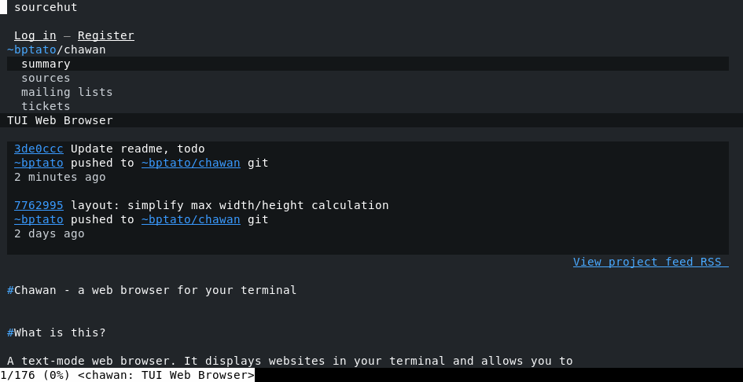

[Chawan](https://chawan.net) is a TUI web (and (S)FTP, Gopher, Gemini,
...) browser with CSS, inline image and JavaScript support.

It uses its own small browser engine developed from scratch, which can
nevertheless display many websites in a manner similar to major graphical
browsers.

It can also be used as a terminal pager.



## Compiling

A Unix-like operating system (Linux, \*BSD, Haiku, macOS, ...) is
assumed.  On Windows you have to use WSL.

1. Clone the Chawan repository:  
   `git clone https://git.sr.ht/~bptato/chawan && cd chawan`
2. Install the Nim compiler: <https://nim-lang.org/install.html>
	* Please use 2.0.0 or newer, ideally 2.2.6.  (`nim -v` displays your
	  Nim compiler's version.)
	  The 1.6 branch from 1.6.14 upwards may still work, but it isn't
	  recommended unless you have no other choice.
	* If you are using a 32-bit system, you probably need 2.2 or newer.
	  2.0 may still work if you `export CFLAGS=-fpermissive`.
3. Install the following dependencies:
	* [OpenSSL](https://www.openssl.org/) (or
	  [LibreSSL](https://www.libressl.org/))
	* [libssh2](https://libssh2.org/)
	* [brotli](https://github.com/google/brotli)
	* pkg-config
	* GNU make (gmake on non-GNU systems)
	* Quick copy-paste for Debian:
	  `apt install libssh2-1-dev libssl-dev libbrotli-dev pkg-config make`
4. Run `make` (without arguments).
5. Install using `make install` (e.g. `sudo make install`).

Then, try:

```bash
$ cha -V # open in visual mode for a list of default keybindings
$ cha example.org # open your favorite website directly from the shell
$ mancha cha # read the cha(1) man page using `mancha'
```

## Packages

You can also install Chawan from packages maintained by volunteers.
Known stable packages are:

* Alpine Linux: <https://pkgs.alpinelinux.org/packages?name=chawan>
* Arch Linux: <https://archlinux.org/packages/extra/x86_64/chawan/>
* FreeBSD: <https://www.freshports.org/www/chawan/>
* Homebrew: <https://formulae.brew.sh/formula/chawan>
* NixOS: <https://search.nixos.org/packages?show=chawan>
* Slackware (SBo): <https://slackbuilds.org/repository/15.0/network/chawan/>
* Fedora (Terra): <https://github.com/terrapkg/packages/tree/frawhide/anda/misc/chawan>

Unstable packages (tip of the `master` branch):

* AUR: <https://aur.archlinux.org/packages/chawan-git>
* AppImage: <https://git.lerch.org/lobo/chawan-appimage/>
* Homebrew (using `--HEAD`): <https://formulae.brew.sh/formula/chawan>

Each [release](https://chawan.net/news/index.html) also comes with static
binaries.  However, their dependencies can quickly get out of date, so
installing a package or compiling Chawan yourself is preferable.

## Features

Currently implemented features are:

* multi-processing, incremental loading of documents
* HTML5 support with various encodings (UTF-8, Shift_JIS, GBK, ...), forms,
  cookies
* [CSS](doc/css.md)-based layout engine: supports flow layout, table layout,
  flexbox layout, double-width characters (CJK)
* user-programmable keybindings (defaults are vi(m)-like), mouse support
* JavaScript support in documents (disabled by default)
* inline image support with [Sixel](https://en.wikipedia.org/wiki/Sixel) or
  [Kitty protocol](https://sw.kovidgoyal.net/kitty/graphics-protocol/)
  (disabled by default; see [doc/image.md](doc/image.md) on how to enable)
* supports several network [protocols](doc/protocols.md): HTTP(S), (S)FTP,
  Gopher, Gemini, Finger, Spartan
* markdown viewer (`cha README.md`), man page viewer (`mancha`)
* [user-defined protocols](doc/urimethodmap.md) and
  [file formats](doc/mailcap.md)
* syscall filter based sandboxing on FreeBSD, OpenBSD and Linux (through
  capsicum, pledge and seccomp-bpf)
* bookmarks, history

...with a lot more [planned](todo).

## Bugs, technical issues, etc.

First, read the [troubleshooting](doc/troubleshooting.md) document.
If it doesn't help, [open a ticket](https://todo.sr.ht/~bptato/chawan).

When using the ticket tracker, please make sure your tickets are valid
markdown, or they become unreadable on the web interface.

If you want to send plain text e-mails not formatted as markdown,
use the [mailing list](mailto:~bptato/chawan-devel@lists.sr.ht) instead.
This is also where you can send patches.

If you're having troubles accessing SourceHut, you can also use the
[Codeberg mirror](https://codeberg.org/bptato/chawan).

## Documentation index

Chawan's documentation is available as man pages (`man cha`) and as
Markdown files.

* build/compilation options: [doc/build.md](doc/build.md)
* `cha` man page: [doc/cha.md](doc/cha.md)
* `mancha` man page: [doc/mancha.md](doc/mancha.md)
* configuration options: [doc/config.md](doc/config.md)
* API description (for keybindings): [doc/api.md](doc/api.md)
* mailcap: [doc/mailcap.md](doc/mailcap.md)
* mime.types: [doc/mime.types.md](doc/mime.types.md)
* urimethodmap: [doc/urimethodmap.md](doc/urimethodmap.md)
* local CGI: [doc/localcgi.md](doc/localcgi.md)
* protocols: [doc/protocols.md](doc/protocols.md)
* inline images: [doc/image.md](doc/image.md)
* CSS: [doc/css.md](doc/css.md)
* terminal compatibility: [doc/terminal.md](doc/terminal.md)
* troubleshooting: [doc/troubleshooting.md](doc/troubleshooting.md)

If you're interested in modifying the code:

* architecture: [doc/architecture.md](doc/architecture.md)
* style guide, debugging tips, etc.: [doc/hacking.md](doc/hacking.md)

## Relatives

[w3m](https://sr.ht/~rkta/w3m) has been the main inspiration for Chawan;
although the two do not share code, the UI and feature set is similar.

[Ferus](https://github.com/ferus-web/ferus) is a separate graphical browser
engine written in Nim, which uses Chawan's HTML parser.

## License

Chawan is dedicated to the public domain. See the UNLICENSE file for details.

Chawan also includes and depends on several permissively licensed libraries.
For further details, check the <about:license> page in Chawan, or read
the same document [here](res/license.md).
